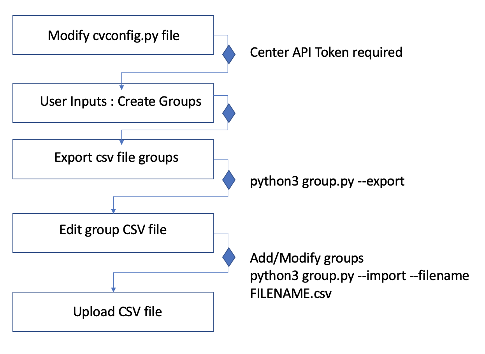
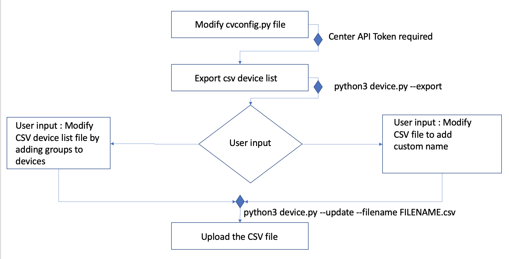
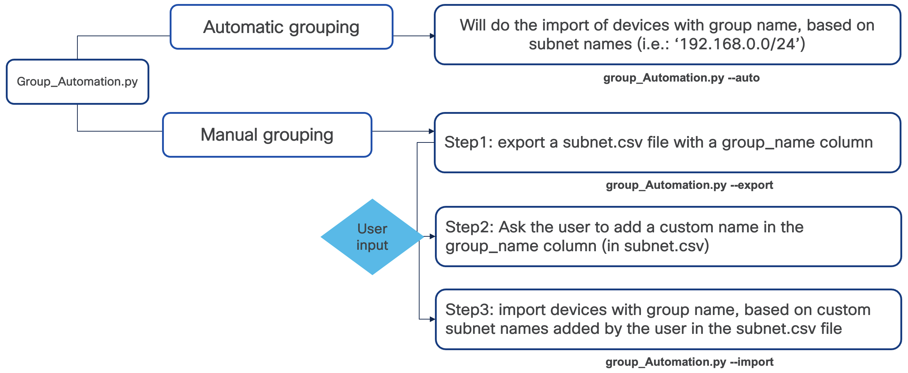

# Cisco Cyber Vision API Scripts

This directory includes several API based scripts for Cyber Vision 4.0

It includes:
 - device.py: export devices to a CSV file ; update devices group and custom name based on the CSV data ; export list of vulnerabilities ; export list of credentials
 - group.py: export groups to a CSV file ; update groups based on the CSV data
 - preset.py: export custom presets to a CSV file ; (update is non working for the moment)
 - custom-networks.py: create, export and delete custom networks; create custom networks based on the CSV data
 - group_automation will automate things and could automatically or with several steps:
    	- export devices to a CSV file "devices.csv" and a list of Subnets "subnet.csv"
     - create groups: automatically with group name as subnet name or manually with manual edition of the subnet.csv file
     - upload all components or devices from a csv file to update group names
 - ack_vuln.py: export devices to a CSV file ; Acknowledges vulnerability in bulk based on preset and cve; Acknowledges vulnerability in bulk based on CSV Data and cve

All scripts are using the API v3

 Nota Bene: device.py / group.py are made to be replacement for the cmdb.py script from 2017 (4 years old). First, they are expecting the user to define the groups and create them as first step. Then in a second step they can use device.py to update the groups of the device. Secondly, as the device are made of several components with various addresses, the device are updated using their ID. So the initial CSV file must be first built using a CSV export and then use device.py to update the devices.


1. cvconfig.py file [Common] part -  

1.1. the API token of the Cyber Vision center needs to be changed  
1.2. if the script is not running on the center, the IP address field need to be updated to reflect the center IP address.

In order to add devices to the groups, please follow these steps :

2. Add groups 

Groups can be added manually or using the group.py script 

2.1 use group.py with export option to get the csv file \
```python3 group.py -export``` \
2.2 Add needed groups to the CSV file then use the import option of group.py script



3. Add devices to a group

3.1 Export device list using the option export of the device.py script
3.2 Update devices group on the .csv file generated and use update option with the modified file so devices will be added to groups

4. Update custom name on Devices

4.1 Export device list using the option export of the device.py script
4.2 On the generated file update the custom name and use update option of device.py scrypt to upload the updated file




5. Auto-groupping options:

5.1 --export : Export subnets and devices into CSV files
5.2 --import : Push to CyberVision Center custom groups and associate devices / xomponents to subnets based on "subnet.csv" (result of the export option which could be edited by the user.)
5.3 --auto : Export subnets and devices into CSV files and push to center new group names, based on subnet names



6. Acknowledging vulnerabilities in bulk

6.1 --export-affected-devices: use ack_vuln.py with export-affected-devices options to export vulnerable devices into CSV file. This operation takes two additional parameters \
a. --cve-id [mandatory] \
b. --export-affected-devices-preset-name  [optional] if this value is not provided, it takes "All data" as default value \
E.g., ``` python3 ack_vuln.py --export-affected-devices --cve-id=CVE-2014-0317 ```

6.2 --ack-by-preset: use ack_vuln.py with ack-by-preset options to acknowledge vulnerable devices by preset name and cve. This operation takes three additional parameters \
a. --cve-id [mandatory] \
b. --ack-by-preset-preset-name  [optional] if this value is not provided, it takes "All data" as default value \
c. --ack-comment [mandatory] 
E.g., ``` python3 ack_vuln.py --ack-by-preset --cve-id=CVE-2014-0317 --ack-comment="Testing Bulk Ack from Python"```

6.3 --ack-by-devices: use ack_vuln.py with ack-by-devices options to acknowledge vulnerable devices that were exported using the --export-affected-devices option. This operation takes additional parameters \
a. --cve-id [mandatory] \
b. --ack-comment [mandatory] 
 
E.g., ``` python3 ack_vuln.py --ack-by-devices --cve-id=CVE-2014-0317 --ack-comment="Testing Bulk Ack from Python"```

Note: Above script does not refresh preset, if you need latest data then kindly refresh preset from GUI and then run above scripts. 
## Requirements

[requirements.txt](requirements.txt)

## License

This project is licensed under the Cisco Sample Code License 1.1 - see the [LICENSE.md](LICENSE.md) file for details

## Further Links

* [Cisco DevNet Website](https://developer.cisco.com)


